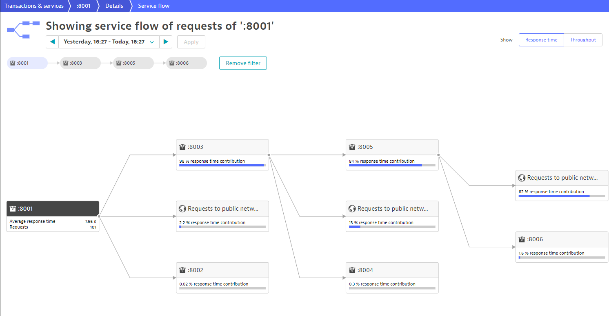

# Generic demo service

Purpose of this service is to simulate specific anomaly situations, such as:

- Slowdowns
- Failures
- Increase in resource consumption
- Process crashes
- Calls to one or more other services

Therefore, this generic service can be used to build all kinds of variable demo 
situations with either flat or deep call trees.

The service listenes on following HTTP resource pathes:
- GET '/' normal page return
- POST '/config' service receives anomaly config as a HTTP POST message with a JSON config payload that is defined below.

## Usage

Start service by specifying a listening port:
./service.exe 8090
Start the service multiple times and let the services call each other
./service.exe 8090
./service.exe 8091

## Dynamically reconfigure the service

Push a http POST request to /config on your started service.

## Config JSON body

Count always represents the number of service requests that suffer from that anomaly, e.g.: a count of 5 means the next 5 service requests are affected.
A crash anomaly kills the service process with the given exit code. The resource anomaly allocates a matrix of 100x100 elements multiplied by the given severity. 
Callees let you specify the callees this service calls with each service request. Specifying callees allows you to build dynamic multi-level service call trees.
```json
{
  "ErrorConfig" : {
    ResponseCode 500
	  Count        5
  },
  "SlowdownConfig" : {
    SlowdownMillis 500
	  Count          1
  },
  "CrashConfig" : {
    Code 3
  },
  "ResourceConfig" : {
    Severity 5
	  Count    2
  },
  "Callees" : [
    { "Adr" : "http://www.example.com", "Count" : 10 },
    { "Adr" : "http://www.orf.at", "Count" : 3 },
    { "Adr" : "http://localhost:8090", "Count" : 3 }
  ]
}
```

## Example topology

The **example1.sh** shell script copies the generic demo service into 6 individual services. Starts those 6 services on the same machine on 6 different ports and configures them to call them each other in the topology shown by Dynatrace below:



